# SANOVIO Procurement System - Architecture Diagrams

This folder contains architecture and design diagrams for the SANOVIO Procurement Request Management System. All diagrams are PNG images.

## Diagrams Index

### System & Stack
| # | Image | Description |
|---|-------|-------------|
| 1 | 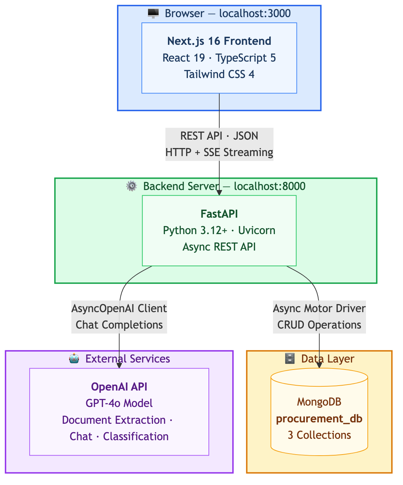 | High-level system architecture — Frontend, Backend, MongoDB, OpenAI |
| 2 | 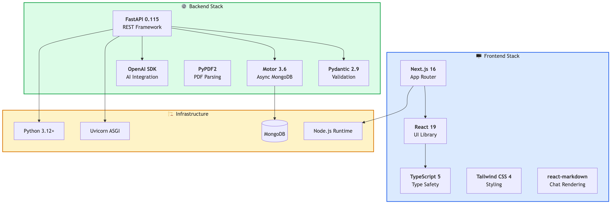 | Full technology stack for frontend, backend, and infrastructure |

### Backend
| # | Image | Description |
|---|-------|-------------|
| 3 | 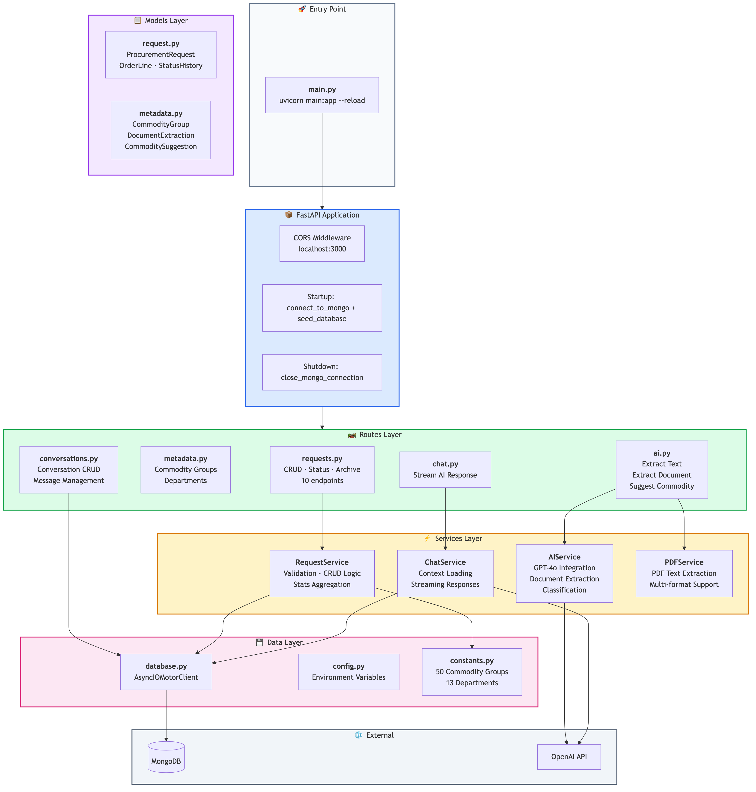 | Backend layered architecture — Routes, Services, Models, Data Layer |
| 5 | 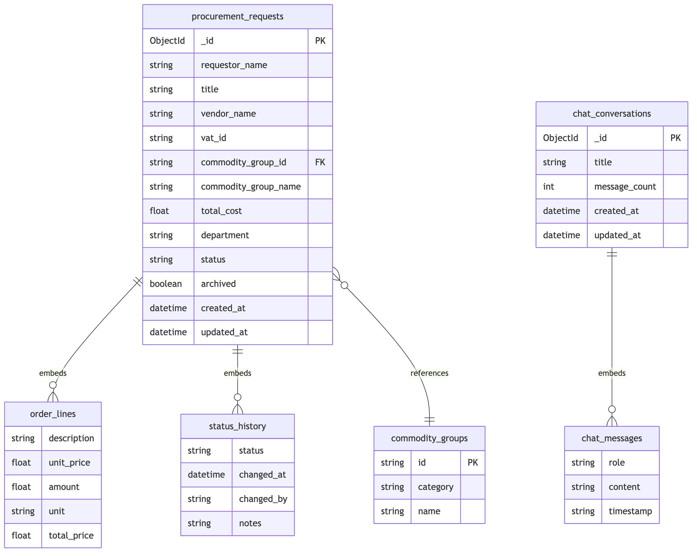 | MongoDB collections ER diagram with relationships |
| 6 | 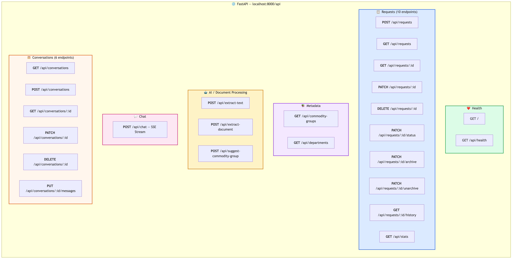 | Complete REST API endpoint map (24 endpoints) |

### Frontend
| # | Image | Description |
|---|-------|-------------|
| 4 | 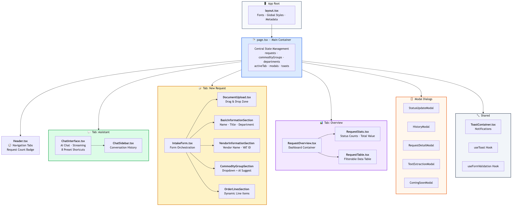 | React component tree and page structure |
| 10 | 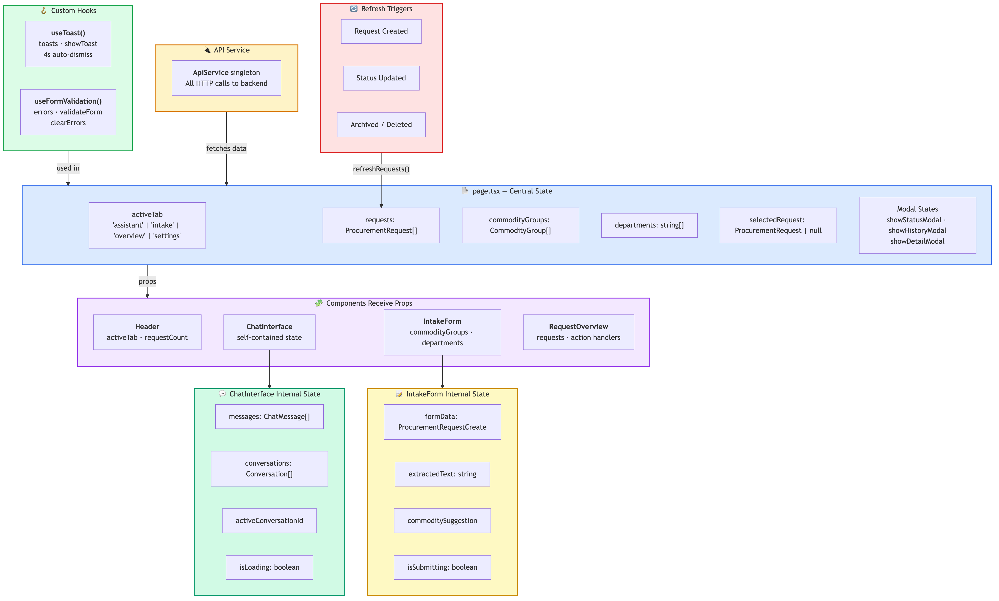 | Frontend state management and data flow |

### User Flow Sequences
| # | Image | Description |
|---|-------|-------------|
| 7 | 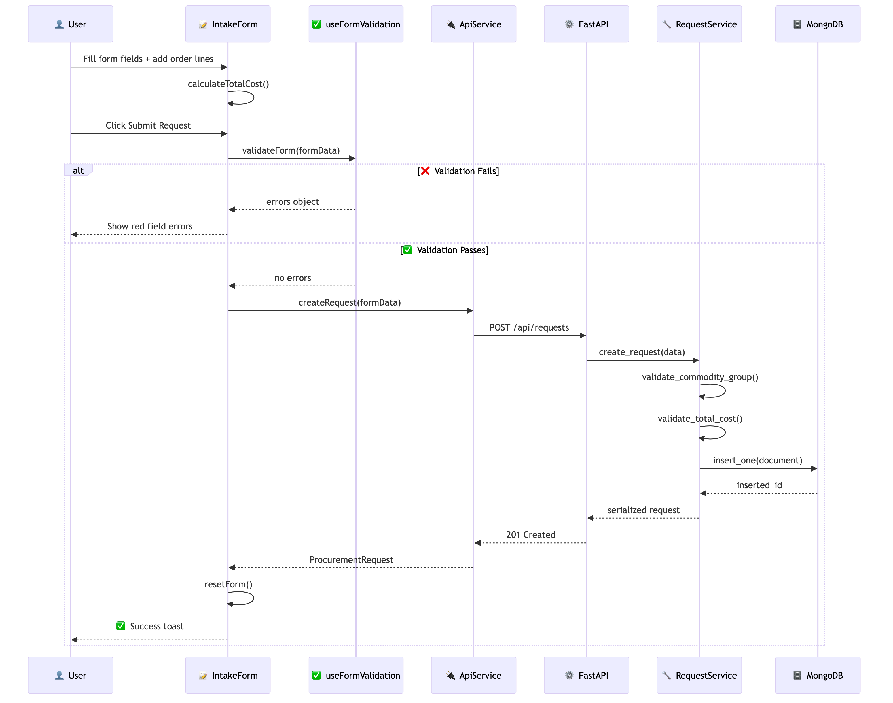 | Create procurement request — form validation and submission |
| 8 | 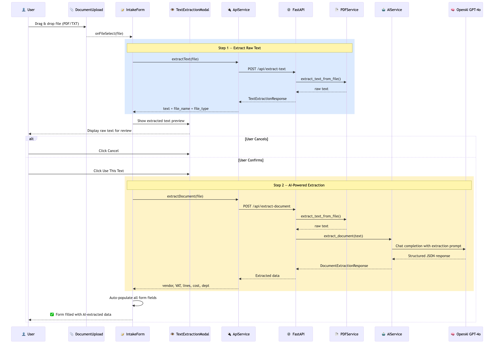 | Upload document — AI-powered text extraction and form auto-fill |
| 9 | 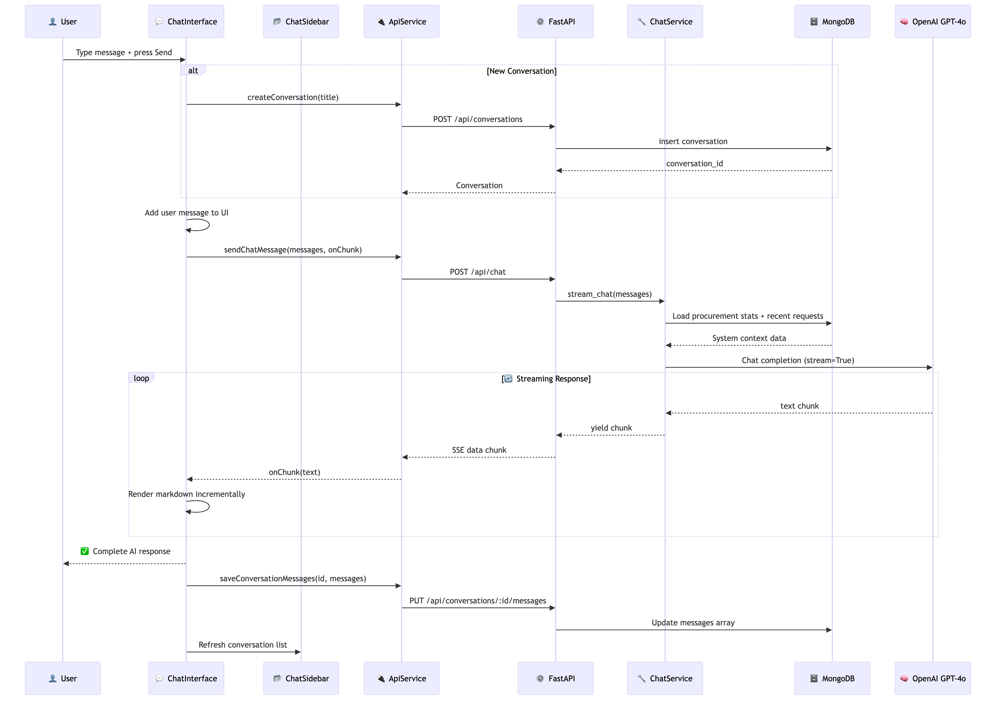 | AI assistant — streaming chat with procurement context |
| 11 | 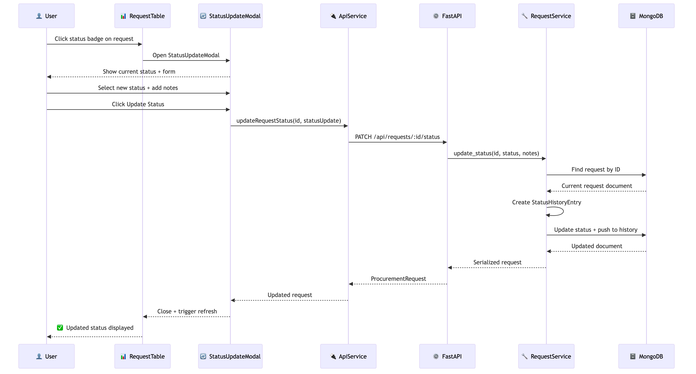 | Request status update with history tracking |
